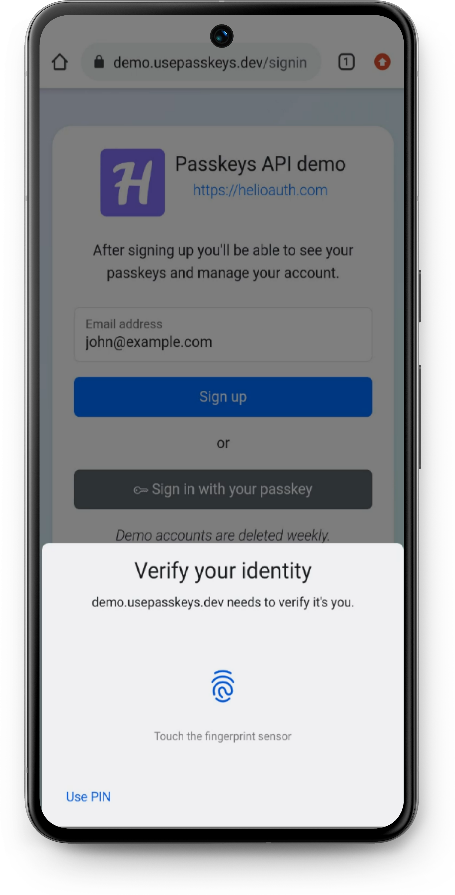

<div align="center">

  
  <h1>HelioAuth Demo</h1>

  <p>
    A passwordless authentication solution for modern web applications 
  </p>


<!-- Badges -->
<p>
  <a href="https://github.com/helioauth/passkeys-api-demo/graphs/contributors">
    
  </a>
  <a href="">
    
  </a>
  <a href="https://github.com/helioauth/passkeys-api-demo/network/members">
    
  </a>
  <a href="https://github.com/helioauth/passkeys-api-demo/stargazers">
    
  </a>
  <a href="https://github.com/helioauth/passkeys-api-demo/issues/">
    
  </a>
  <a href="https://github.com/helioauth/passkeys-api-demo/blob/master/LICENSE">
    
  </a>
</p>

<h4>
    <a href="https://demo.usepasskeys.dev/">View Demo</a>
  <span> · </span>
    <a href="https://github.com/helioauth/passkeys-api-demo">Documentation</a>
  <span> · </span>
    <a href="https://github.com/helioauth/passkeys-api-demo/issues/">Report Bug</a>
  <span> · </span>
    <a href="https://github.com/helioauth/passkeys-api-demo/issues/">Request Feature</a>
  </h4>
</div>

<br />

<!-- Table of Contents -->
# :notebook_with_decorative_cover: Table of Contents

- [About the Project](#star2-about-the-project)
    * [Tech Stack](#space_invader-tech-stack)
    * [Features](#dart-features)
    * [Environment Variables](#key-environment-variables)
- [Getting Started](#toolbox-getting-started)
    * [Prerequisites](#bangbang-prerequisites)
    * [Installation](#gear-installation)
    * [Run Locally](#running-run-locally)
- [Usage](#eyes-usage)
- [Roadmap](#compass-roadmap)
- [Contributing](#wave-contributing)
    * [Code of Conduct](#scroll-code-of-conduct)
- [License](#warning-license)
- [Contact](#handshake-contact)
- [Acknowledgements](#gem-acknowledgements)


<!-- About the Project -->
## :star2: About the Project

<div align="center"> 
  
</div>


<!-- TechStack -->
### :space_invader: Tech Stack

<details>
  <summary>Server</summary>
  <ul>
    <li><a href="https://www.java.com/">Java</a></li>
    <li><a href="https://spring.io/projects/spring-boot">Spring Boot</a></li>
    <li><a href="https://spring.io/projects/spring-security">Spring Security</a></li>
  </ul>
</details>

<details>
<summary>Database</summary>
  <ul>
    <li><a href="https://www.postgresql.org/">PostgreSQL</a></li>
  </ul>
</details>

<details>
<summary>DevOps</summary>
  <ul>
    <li><a href="https://www.docker.com/">Docker</a></li>
    <li><a href="https://kubernetes.io/">Kubernetes</a></li>
  </ul>
</details>

<!-- Features -->
### :dart: Features

- WebAuthn (passkey) authentication
- Magic link fallback authentication *(work in progress)*
- User dashboard

<!-- Env Variables -->
### :key: Environment Variables

To run this project, you will need to add the following environment variables:

`DATABASE_URL` - JDBC-compatible database url e.g. `jdbc:postgresql://localhost:5432/demodb`

`RELYINGPARTY_DISPLAY_NAME` - The name that shows up on the client when registering/authenticating with WebAuthn, e.g. `HelioAuth Demo`

`RELYINGPARTY_HOSTNAME` - The origin (domain) where the application is hosted, e.g. `demo.usepasskeys.dev`

<!-- Getting Started -->
## 	:toolbox: Getting Started

<!-- Prerequisites -->
### :bangbang: Prerequisites

This project uses Java 22 and Maven 

```bash
  git clone https://github.com/helioauth/passkeys-api-demo.git
```

<!-- Run Locally -->
### :running: Run Locally

Go to the project directory

```bash
  cd passkeys-api-demo
```

Install dependencies

```bash
  ./mvnw install
```

Start PostgreSQL server

```bash
  docker-compose up -d
```

Start the demo

```bash
  ./mvnw spring-boot:run
```

<!-- Contributing -->
## :wave: Contributing

<a href="https://github.com/helioauth/passkeys-api-demo/graphs/contributors">
  
</a>


Contributions are always welcome!

<!-- License -->
## :warning: License

Distributed under the MIT License. See [LICENSE](LICENSE) for more information.


<!-- Contact -->
## :handshake: Contact

HelioAuth: [https://helioauth.com/](https://helioauth.com/)

Project Link: [https://github.com/helioauth/passkeys-api-demo](https://github.com/helioauth/passkeys-api-demo)

<!-- Acknowledgments -->
## :gem: Acknowledgements

Use this section to mention useful resources and libraries that you have used in your projects.

- [java-webauthn-server by Yubico](https://github.com/Yubico/java-webauthn-server)